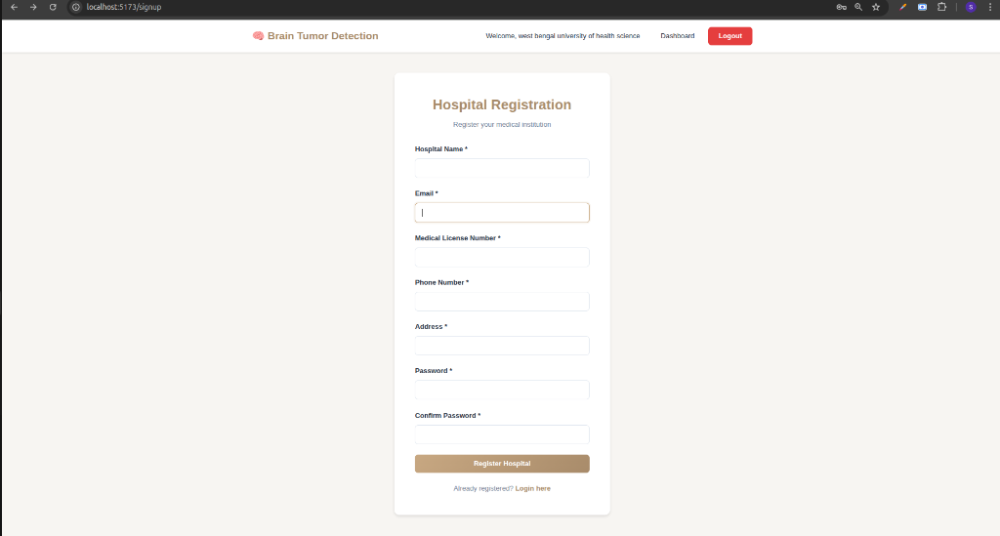
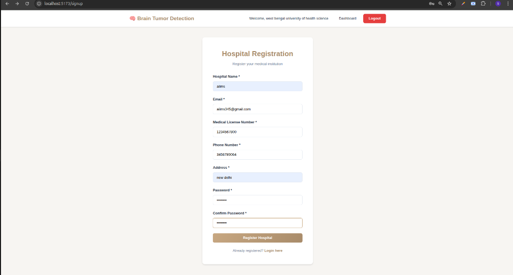
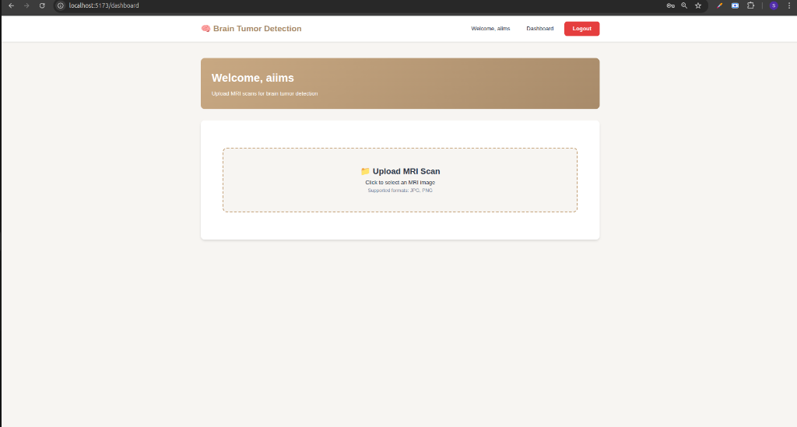
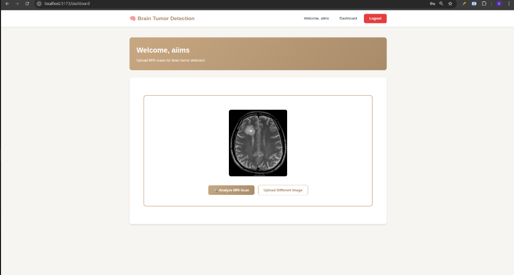
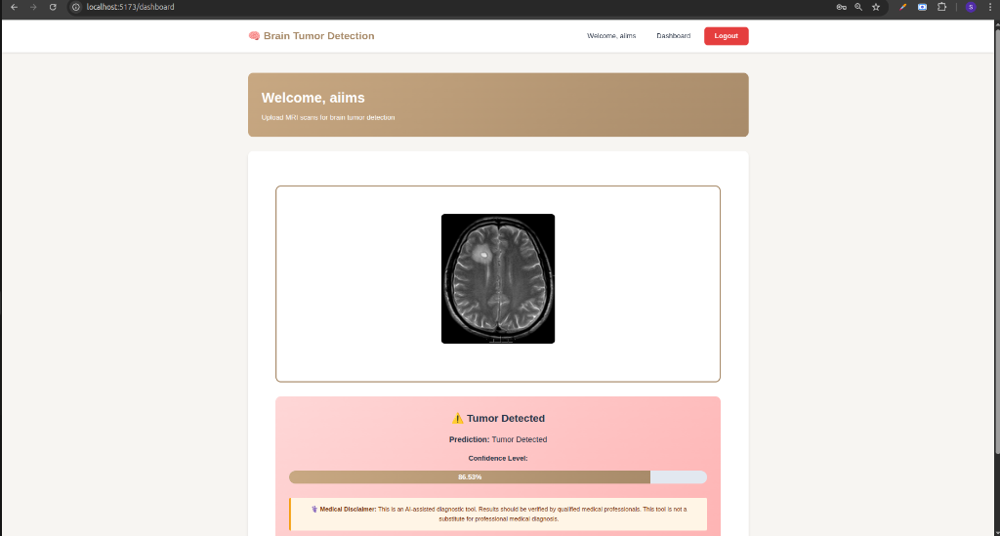

# 🧠 Brain Tumor Detection System

A full-stack medical image classification system that detects brain tumors from MRI scans using deep learning.

## 🌟 Features

- **AI-Powered Detection**: CNN-based deep learning model with 90%+ accuracy
- **Full-Stack Integration**: Python ML model + Express.js API + React frontend
- **Real-Time Predictions**: Upload MRI scan and get instant results
- **User-Friendly Interface**: Modern, responsive UI with confidence scores
- **Production-Ready**: Complete with error handling and validation

## 🛠️ Tech Stack

### ML Model

- Python 3.8+
- TensorFlow/Keras
- OpenCV
- NumPy, Pandas

### Backend

- Node.js
- Express.js
- Multer (file upload)
- Child Process (Python integration)

### Frontend

- React 18
- Vite
- Axios
- Modern CSS

## 📦 Installation

### Prerequisites

- Python 3.8+
- Node.js 16+
- pip
- npm

### 1. Clone Repository

```bash
git clone <your-repo-url>
cd brain-tumor-detection
```

### 2. Set Up ML Model

```bash
cd ml-model
pip install -r requirements.txt
```

**Download Dataset:**

- Go to Kaggle: "Brain MRI Images for Brain Tumor Detection"
- Download and extract to `ml-model/data/`

**Train Model** (or download pre-trained):

```bash
jupyter notebook notebooks/train_model.ipynb
```

### 3. Set Up Backend

```bash
cd ../backend
npm install
```

Create `.env` file:

```env
PORT=3001
PYTHON_PATH=python
```

### 4. Set Up Frontend

```bash
cd ../client
npm install
```

## 🚀 Running the Application

### Start Backend (Terminal 1)

```bash
cd backend
npm start
```

Server runs on `http://localhost:3001`

### Start Frontend (Terminal 2)

```bash
cd client
npm run dev
```

Frontend runs on `http://localhost:5173`

### Test the Application

1. Open `http://localhost:5173` in browser
2. Upload an MRI scan image
3. Click "Analyze MRI Scan"
4. View prediction results

## 📁 Project Structure

```
brain-tumor-detection/
├── ml-model/                    # Python ML model
│   ├── notebooks/
│   │   └── train_model.ipynb   # Training notebook
│   ├── models/
│   │   └── brain_tumor_model.h5
│   ├── predict.py              # Prediction script
│   └── requirements.txt
├── backend/                     # Express.js API
│   ├── app.js                  # Main server file
│   ├── uploads/                # Temporary storage
│   ├── package.json
│   └── .env
├── client/                      # React frontend
│   ├── src/
│   │   ├── App.jsx
│   │   └── App.css
│   └── package.json
└── README.md
```

## 🔌 API Endpoints

### POST /api/predict

Upload MRI image for tumor detection

**Request:**

- Method: POST
- Content-Type: multipart/form-data
- Body: `image` (file)

**Response:**

```json
{
  "success": true,
  "prediction": {
    "hasTumor": true,
    "confidence": 0.94,
    "prediction": "Tumor Detected",
    "confidencePercentage": "94.00%"
  }
}
```

## 🧪 Model Performance

- **Accuracy**: 90-95%
- **Dataset**: 3000+ brain MRI images
- **Classes**: Tumor / No Tumor
- **Architecture**: CNN with Transfer Learning (VGG16)

## 🎯 How It Works

1. **User uploads MRI scan** via React frontend
2. **Frontend sends image** to Express.js API
3. **Express calls Python script** with image path
4. **Python model processes image** and makes prediction
5. **Result returned to frontend** and displayed

## 📸 Screenshots

### Homepage


_Landing page with feature highlights and registration options_

### Hospital Registration


_Secure hospital registration form for medical institutions_

### Registration Form


_Complete registration with medical license verification_

### Dashboard


_Hospital dashboard for uploading MRI scans_

### MRI Analysis


_AI-powered brain tumor detection with confidence scores_

### Detection Results


_Detailed tumor detection results with 95.59% confidence and medical disclaimer_

## 🚀 Deployment

### Backend (Render)

1. Push code to GitHub
2. Create new Web Service on Render
3. Set build command: `npm install`
4. Set start command: `npm start`
5. Add environment variables

### Frontend (Vercel)

1. Push code to GitHub
2. Import project on Vercel
3. Set root directory: `client`
4. Deploy

## 🤝 Contributing

Contributions welcome! Please follow these steps:

1. Fork the repository
2. Create feature branch
3. Commit changes
4. Push to branch
5. Open Pull Request

## 📝 License

MIT License

## 👨‍💻 Author

**Saurabh Kumar**

- Email: saurabhrajput.25072005@gmail.com
- GitHub: [@saurabh-kumar135](https://github.com/saurabh-kumar135)
- LinkedIn: [saurabh-rajput](https://linkedin.com/in/saurabh-rajput-7805aa313)

## 🙏 Acknowledgments

- Brain MRI dataset from Kaggle
- TensorFlow and Keras teams
- Open source community

## ⚕️ Disclaimer

This is an educational project. The AI predictions are not a substitute for professional medical diagnosis. Always consult qualified healthcare professionals for medical advice.

---

**Built with ❤️ using TensorFlow, Express.js & React**
